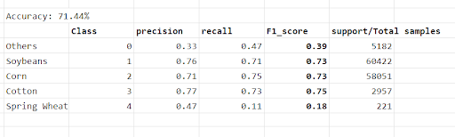
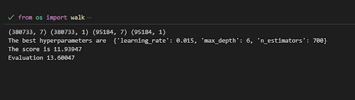

# Forecast 2023

A forecast model can be incredibly useful predicting future outcomes based on historical client data and relevant factors. 
* Total number Proag CLUs :  127,574
* New proag CLU’S : 18,529
* Proag history data:  2018-2022
* PW Forecast 2023 years: 2015-2022
* Additional source data: USDA Crop data layer Cropscape
* Total number PW CLUs predicted: 127,240
​
## Dataset
​
The client data set can be found and download [here](https://s3.console.aws.amazon.com/s3/buckets/pw-algo-team-dataset-forcast-2023?region=us-east-1&tab=objects)​

## Usage
The forecast has three types of results: acreage prediction, planting dates, and crop identification predictions.​
The main script is ```main.py``` which you can find in this [repo](
https://github.com/lilianMLPlanet/Forecast_2023.git)
​
1. To train and inference the acreage model.

```python
python main.py 'train_acreage_model'
```
2. To train and inference the crop identification. 
```python
python main.py 'train_ci_model'
``` 
3. To train and inference the Planting dates. 
```python
python main.py 'train_planting_model'
``` 
## Performance
​
For the Acreage model the valuation was made for the year 2022. 
* the MAE = 1.56
* The MSE = 15.7 

For the evaluation  crop identification model crops of 2022.


For Planting date evaluation the metric for 2022 are.

